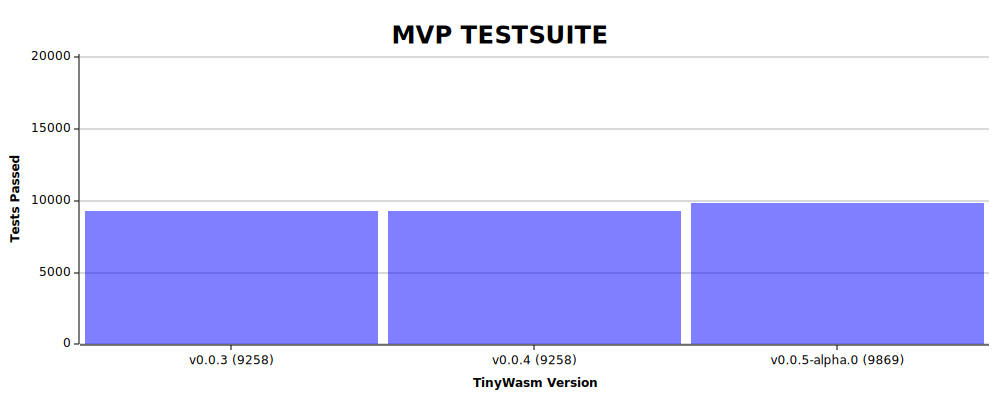

    

        
    

    <h1>TinyWasm</h1>
    A tiny WebAssembly Runtime written in Rust

 

  

# 🚧 Status

> [!WARNING]
> This project is still in development and is not ready for use.

I'm currently working on supporting the WebAssembly MVP (1.0) specification. You can see the current status in the graph below. The goal is to support all the features of the MVP specification and then move on to the next version.

  

## Features

- **`std`**\
  Enables the use of `std` and `std::io` for parsing from files and streams. This is enabled by default.
- **`logging`**\
  Enables logging using the `log` crate. This is enabled by default.
- **`parser`**\
  Enables the `tinywasm-parser` crate. This is enabled by default.

# 🎯 Goals

- Interpreted Runtime (no JIT)
- Self-hosted (can run itself compiled to WebAssembly)
- No unsafe code
- Works on `no_std` (with `alloc` the feature and nightly compiler)
- Fully support WebAssembly MVP (1.0)
- Low Memory Usage (less than 10kb)
- Fast Startup Time
- Preemptive multitasking support

# 📄 License

Licensed under either of [Apache License, Version 2.0](./LICENSE-APACHE) or [MIT license](./LICENSE-MIT) at your option.

Unless you explicitly state otherwise, any contribution intentionally submitted for inclusion in TinyWasm by you, as defined in the Apache-2.0 license, shall be dual licensed as above, without any additional terms or conditions.

**Note:** The GitHub repository contains a Submodule (`crates/tinywasm-parser/data`) which is licensed only under the [Apache License, Version 2.0](https://github.com/WebAssembly/spec/blob/main/test/LICENSE). This is because the data is generated from the [WebAssembly Specification](https://github.com/WebAssembly/spec/tree/main/test) and is only used for testing purposes and is not included in the final binary.
